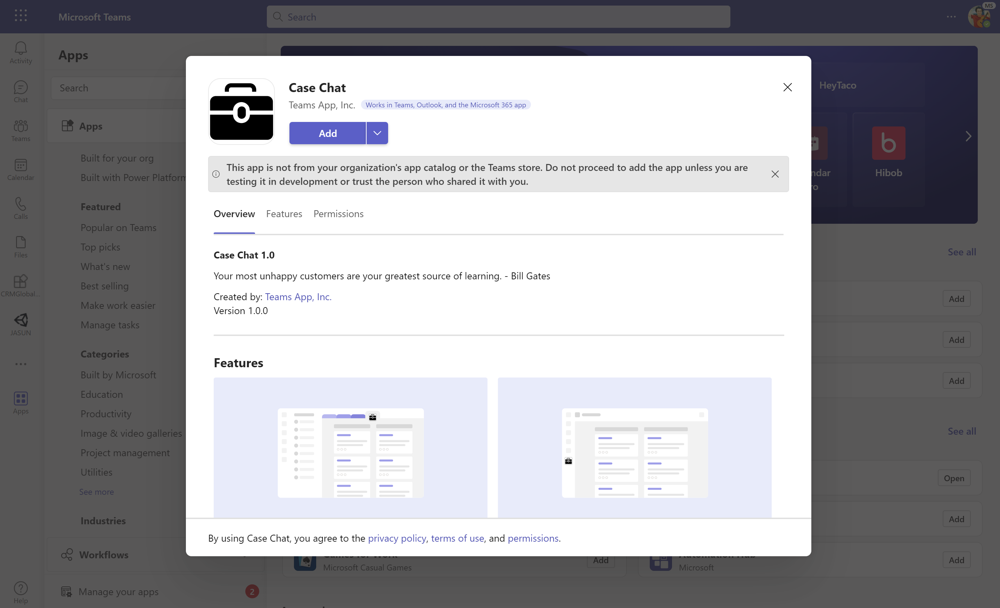
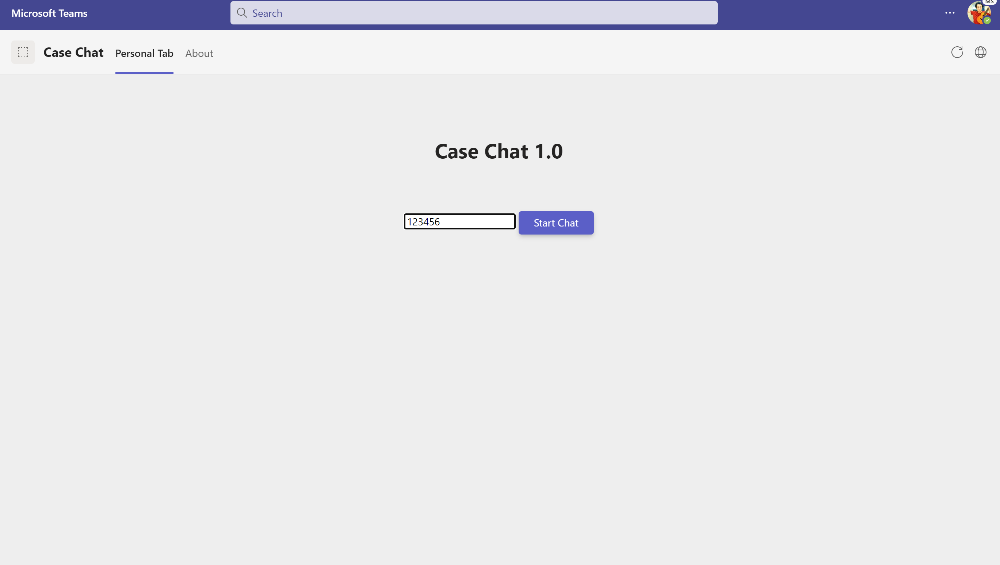
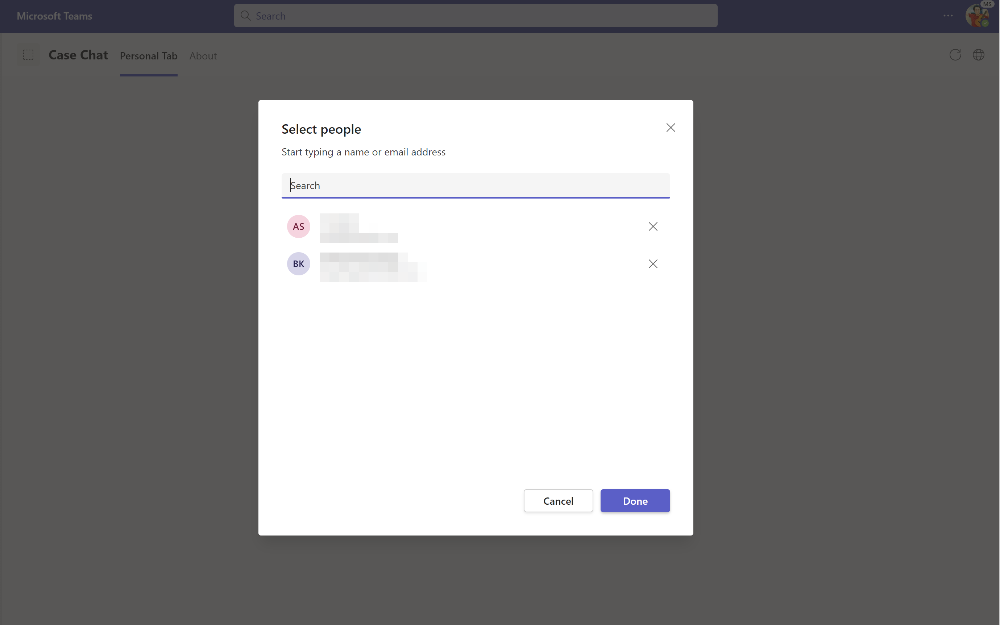
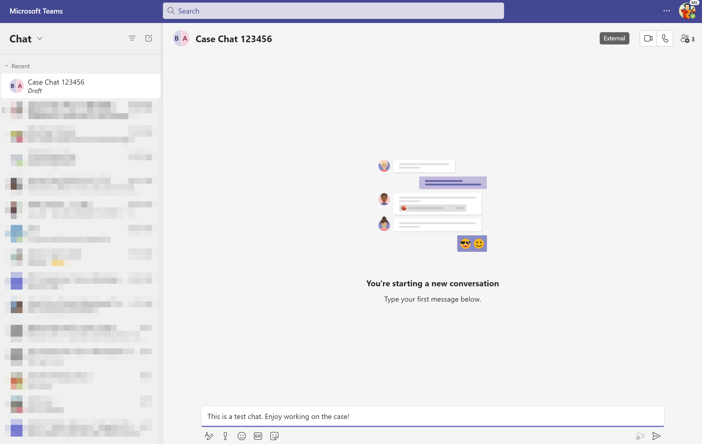

# teams-bot

### References
1. [support-ticket-alerts](https://learn.microsoft.com/en-us/training/modules/teams-toolkit-vsc-create-bot/)
2. [teams-tab-with-chat](https://learn.microsoft.com/en-us/training/modules/teams-toolkit-vsc-integrate-chat/)

### Screenshots






### Next Steps

Call API to fetch current case owners and collaborators to be stored in the "peoplePickerResults" variable.

```
if (people.isSupported() && chat.isSupported()) { 
  const peoplePickerResults = await people.selectPeople(); // to be replaced
  const users = peoplePickerResults.map(p => p.email); 
  await chat.openGroupChat({ 
		users, 
		topic: "Case Chat " + caseId, 
		message: "This is a test chat. Enjoy working on the case!", 
  }); 
} 
```